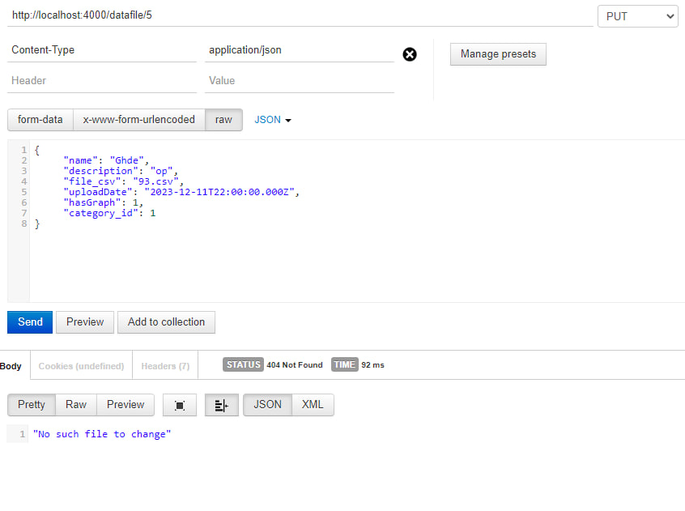

# Тестування працездатності системи

## Запуск сервера на 4000 порті

## Перевірка правильної роботи пошуку (Get)

### Відображення всіх файлів

### Пошук файлу по id

### Пошук неіснуючого файлу

## Перевірка правильної роботи додавання (Post)

### Додавання файлу в базу даних

### Перевірка всіх файлів

### Перевірка на унікальність id

### Перевірка на залишання порожніх полів

## Перевірка правильної роботи зміни (Put)

### Відображення що на що хочемо змінити

### Результат

### Зміна неіснуючого файлу

### Перевірка бази даних

### Зміна файлу з пустими полями

### Результат

### Перевірка бази даних

## Перевірка правильної роботи видалення (Delete)

### Видалення файлу

### Перевірка бази даних після видалення

### Видалення неіснуючого файлу
